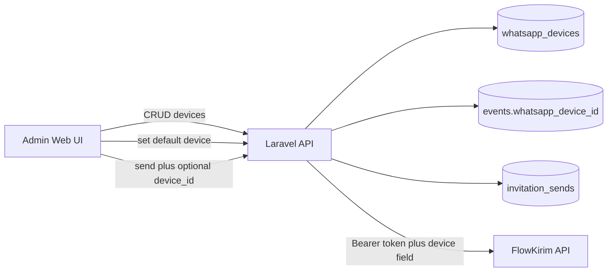

# WhatsApp FlowKirim Multi-Device + Admin UI

**Date:** 2026-09-16  
**Status:** Approved  
**Extends:** `2026-09-16-whatsapp-flowkirim-invitation-design.md`

## Goal

Support multiple FlowKirim WhatsApp devices: manage them in admin, set a default sender per event, and optionally override the device when sending invitations. Ship API changes in `wedding-invitation-api` and admin UI in `wedding-invitation-web`.

## Decisions

- **Multi-device model C:** global device catalog + per-event default + per-send override.
- **Credentials model A:** single `FLOWKIRIM_API_TOKEN` in `.env`; devices store FlowKirim `provider_device_id` only (no per-device tokens in admin).
- **Storage approach 1:** dedicated `whatsapp_devices` table + FKs on `events` and `invitation_sends`.
- **Admin UI:** API + frontend (`wedding-invitation-web`) together.
- **Delivery:** remains synchronous (shared hosting), unchanged from v1 send design.

## Architecture



### Device resolution when sending

1. Use request body `device_id` if present (local `whatsapp_devices.id`).
2. Else use `event.whatsapp_device_id`.
3. Else fail with a clear validation/business error (no FlowKirim call).
4. Load active device; use `provider_device_id` in the FlowKirim payload.
5. Persist `invitation_sends.whatsapp_device_id` for the attempt.

Token always comes from env (`FLOWKIRIM_API_TOKEN`). Admin UI does **not** edit the token.

### FlowKirim payload field

Docs are inconsistent (`device_id` / `device` / `sessionId`). Configurable:

```env
FLOWKIRIM_DEVICE_FIELD=device_id
```

`FlowkirimService::sendText` includes that field with the device’s `provider_device_id`.

## Data model

### `whatsapp_devices`

| Column | Notes |
|--------|--------|
| `id` | Local PK |
| `name` | Admin label (e.g. "WA Panitia 1") |
| `provider_device_id` | FlowKirim device/session id |
| `phone_label` | Optional display phone |
| `is_active` | Boolean, default true |
| timestamps | |

### Schema changes

- `events.whatsapp_device_id` — nullable FK → `whatsapp_devices` (`nullOnDelete`)
- `invitation_sends.whatsapp_device_id` — nullable FK → `whatsapp_devices` (`nullOnDelete`)

Primary admin action to retire a device: set `is_active=false`. `DELETE` hard-deletes only when the device is not referenced by any `events` or `invitation_sends`; otherwise return 422 and ask admin to deactivate instead.

## API

Admin Sanctum + `role:admin`:

| Method | Path | Purpose |
|--------|------|---------|
| GET | `/api/whatsapp-devices` | List devices |
| POST | `/api/whatsapp-devices` | Create |
| GET | `/api/whatsapp-devices/{device}` | Show |
| PUT/PATCH | `/api/whatsapp-devices/{device}` | Update |
| DELETE | `/api/whatsapp-devices/{device}` | Hard delete if unused; 422 if still referenced |

Event default:

- Extend event show/update payloads with `whatsapp_device_id` (and optional nested device summary).
- Admin sets default via existing `PUT/PATCH /api/events/{event}`.

Send (existing endpoints):

- Body may include optional `device_id` (local id).
- Response and history include device summary: `id`, `name`, `phone_label`, `provider_device_id`.

Validation:

- Inactive / missing device → fail send for that guest (bulk continues).
- No request device and no event default → 422 on single send; bulk marks failed with clear error.

## Admin UI (`wedding-invitation-web`)

1. **Nav:** “WhatsApp Devices” (admin only) → CRUD page.
2. **Events:** dropdown “Device pengirim default” (active devices only).
3. **Guests page:** send WhatsApp (single + bulk):
   - message template with `{nama}`, `{link}`
   - device dropdown (defaults to event device; override allowed)
   - surface last send status / link to history where practical

Device pairing/QR remains in the FlowKirim dashboard (out of scope).

## Error handling

- Missing/invalid guest phone → `failed` (existing).
- Unresolved device → `failed` / 422 as above.
- FlowKirim HTTP errors → `failed` + truncated error (existing).
- Bulk max 50 unchanged.

## Testing

**API**

- Device CRUD
- Event default persistence
- Send with override vs event default
- Inactive device rejected
- History includes device

**Frontend**

- Device form / list smoke tests if existing Vitest patterns fit
- Guests send dialog uses API helpers correctly

## Out of scope

- Auto-sync from FlowKirim `GET /v1/devices`
- QR pairing inside our admin
- Per-device API tokens
- Queue/async sending
- Delivery webhooks

## Implementation order

1. Migrations + models/relations (`WhatsappDevice`, Event/Guest send FKs)
2. Config `FLOWKIRIM_DEVICE_FIELD` + update `FlowkirimService` / `InvitationWhatsappService`
3. Device CRUD controller + routes; extend event + send payloads
4. Feature tests
5. Frontend: devices page, event default, guests send UI
6. Update `.env.example` and extend the original FlowKirim design note if needed
